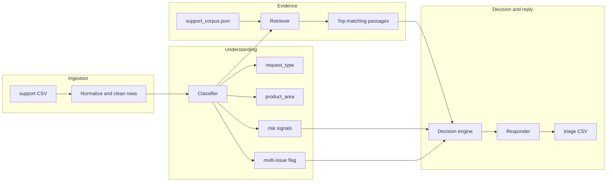

# Support Triage Agent

**Corpus-grounded CLI that turns messy support CSVs into triage-ready decisions—without inventing policies.**

[](https://www.python.org/downloads/)
[](./requirements.txt)

This project is a small **terminal-based support intelligence pipeline**: ingest tickets, classify risk and intent, retrieve answers **only** from your own documentation JSON, then either draft a safe reply or **escalate** when the stakes are too high or the evidence is too thin.

If you’ve ever seen an AI bluff about refunds, SOC2, or “I’ve reset your billing”—you already know why this design exists.

---

## What you get after one command

| You provide | You receive |
|-------------|-------------|
| A CSV of tickets (`subject`, `description`, optional `company`, …) | A CSV row per ticket with **status**, **product_area**, **grounded response**, **justification**, **request_type**, **confidence_score** |
| Local help articles in JSON (`support_corpus.json`) | Replies that **quote and paraphrase only that corpus**—no web, no model memory, no policy fiction |

Escalations get a polite handoff template, not speculative fixes.

---

## The rules (non-negotiable)

1. **No hallucinated policy.** If it is not supported by retrieval from `support_corpus.json`, we do not pretend it is official guidance.
2. **When in doubt → escalate.** Weak matches, vagueness, and multi-issue threads default to humans.
3. **Sensitive rails always win.** Signals for **fraud**, **billing disputes**, **account access / recovery**, and **security** force **escalation** before any detailed auto-reply.

These constraints are enforced in code, not vibes.

---

## Architecture



**Module map**

| Module | Responsibility |
|--------|----------------|
| `main.py` | CLI: argparse, orchestration, CSV writer |
| `support_triage/ingestion.py` | Load CSV with flexible headers; strip noise; tolerate missing company |
| `support_triage/classifier.py` | `request_type`, `product_area`, risk categories, multi-issue detection (including inline `1) … 2) …`) |
| `support_triage/retriever.py` | Keyword overlap + signal tokens; corpus load from JSON |
| `support_triage/decision_engine.py` | **replied** vs **escalated** + confidence heuristic |
| `support_triage/responder.py` | Customer-facing copy from retrieved snippets only; neutral escalation text otherwise |

Corpus lives at `support_triage/data/support_corpus.json`.

---

## Quick start

**Requirements:** Python **3.10+**. No pip install required (standard library only).

```bash
cd support_triage
python3 main.py --input sample_support_tickets.csv --output triage_output.csv --verbose
```

**Defaults:** reads `support_tickets.csv`, writes `triage_output.csv`.

```bash
python3 main.py
```

**Custom corpus path**

```bash
python3 main.py -c /path/to/your/support_corpus.json -i tickets.csv -o results.csv
```

---

## CLI reference

| Flag | Meaning |
|------|---------|
| `-i`, `--input` | Input CSV path |
| `-o`, `--output` | Output CSV path |
| `-c`, `--corpus` | Override path to corpus JSON |
| `-v`, `--verbose` | DEBUG logging (otherwise INFO) |

Successful runs log ticket count, corpus document count, and output path.

---

## Input CSV (flexible headers)

Headers are matched case-insensitively.

| Concept | Accepted column names (examples) |
|---------|----------------------------------|
| Ticket id | `ticket_id`, `id`, `ticket`, `case_id` |
| Company | `company`, `organization`, `org` |
| Subject | `subject`, `title`, `summary` |
| Body | `description`, `body`, `message`, `details`, `issue`, `content` |

**Missing company:** `product_area` is inferred from the message; decision confidence reflects slightly higher uncertainty when company was inferred.

---

## Output CSV

Each row aligns with one input ticket plus machine reasoning.

| Column | Description |
|--------|--------------|
| `ticket_id` | From input or auto `row_<n>` if missing |
| `status` | `replied` or `escalated` |
| `product_area` | Inferred routing bucket (e.g. `billing`, `api`, `authentication`, `general`) |
| `response` | Safe customer-facing text; for `replied`, grounded in corpus snippets |
| `justification` | Short audit trail explaining the decision |
| `request_type` | `product_issue` \| `feature_request` \| `bug` \| `invalid` |
| `confidence_score` | Heuristic \(0\)–\(1\) for how solid the automation thinks the decision is—not a calibrated ML probability |

**Example logical record**

```json
{
  "status": "escalated",
  "product_area": "billing",
  "response": "Thank you for contacting support. Your request has been forwarded…",
  "justification": "Sensitive topic detected (billing); policy requires specialist review.",
  "request_type": "product_issue",
  "confidence_score": "0.900"
}
```

(Actual interchange format is CSV; this is the same fields.)

---

## How decisions are made (plain English)

- **Retriever score** measures overlap between ticket tokens and corpus entries (plus small bonuses for titled matches, product-area alignment, and “signal” keywords like `csv`, `429`, `password`, …).
- **Multi-issue tickets** tighten the bar: automation only replies when retrieval is *very* strong; otherwise humans split the threads.
- **Export-style questions** deprioritize generic billing snippets so export FAQs stay first when the user clearly asked for CSV/export.

Tune thresholds in `support_triage/decision_engine.py` and scoring in `support_triage/retriever.py` if your volume or risk appetite differs.

---

## Extending the corpus

Edit `support_triage/data/support_corpus.json`. Each object supports:

- `id` — stable string id  
- `title` — human title  
- `product_area` — routing tag  
- `body` — text the agent may surface (keep it truthful and internally approved)  
- `keywords` — extra matching terms  

The richer and more specific your corpus, the more often you can responsibly choose **replied** instead of **escalated**.

---

## Repository layout

```
support_triage/
├── main.py
├── requirements.txt          # documents Python 3.10+ ; no third-party pins
├── sample_support_tickets.csv
├── support_tickets.csv       # default input for quick runs
├── README.md
└── support_triage/
    ├── ingestion.py
    ├── classifier.py
    ├── retriever.py
    ├── decision_engine.py
    ├── responder.py
    └── data/
        └── support_corpus.json
```

---

## Contributing

Issues and PRs welcome: improve classifiers with care (avoid exploding false escalations), add regression samples to `sample_support_tickets.csv`, and grow the corpus JSON with **real**, approved content—not marketing fluff.

---

## Author

Maintained as a reference implementation for **safe, corpus-limited support automation**.

Remote: [github.com/SayAn1-dls/HackerRank](https://github.com/SayAn1-dls/HackerRank)
